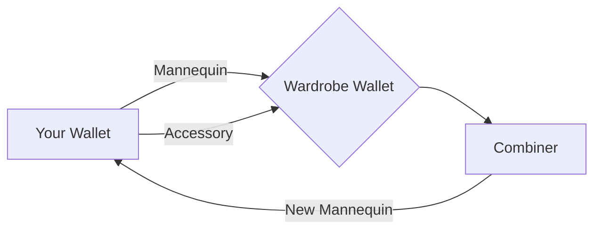
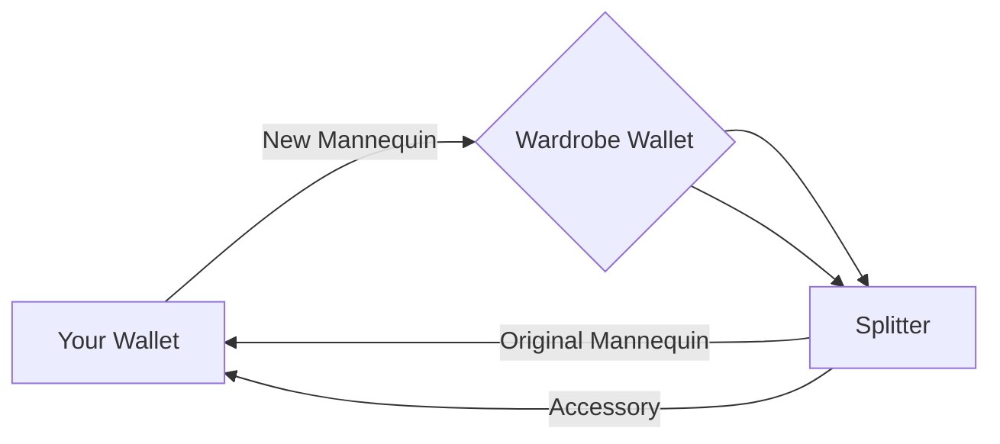

 
# NFT-Art.ist Mannequins

Hi! This is where you get your space on **NFT-Art.ist**. If you want to get your exclusive space to link directly to your profiles, projects personal accounts.

Only 1000 Mannequins exist and only 1000 spaces available on the website. [NFT-art.ist](https://nft-art.ist/)

Every Mannequin is one space on the website that will link directly to you and your project/account/website. Advertise yourself equally along side everyone else in a randomly ordered array where everyone gets equal display at the top of the site.

# Future

Airdrop planned of accessories and edits for your mannequins with a system in place to personalise your mannequin to suit you.
> Combiner Example

This will make your mannequin equal both the original mannequin and the accessory added, being able to be swapped back whenever.
> Splitter Example

## Roadmap

|                |Aspect                         |Status                     |
|----------------|-------------------------------|-----------------------------|
|Website 		 |Under Construction            | Currently working on 
|Discord| Community Discord | Currently        working on  
|PFP             |1000 Mannequins				|Ready to go|
|Airdrop         |Accessories                   |Planned for future
|Combiner| Combiner system | Ready to go 
|Personal Page   |Page of website just for you  |Planned for future
|Locked Access | NFT Key Website Areas | Planned for future
|Website More | More areas of the website including full roadmap page |Planned for future

## Right now

Get your PFP Mannequin and look out, follow twitter, Instagram and join the discord for updates on when and how to get your personalised space on the website and all future aspects of the project.
